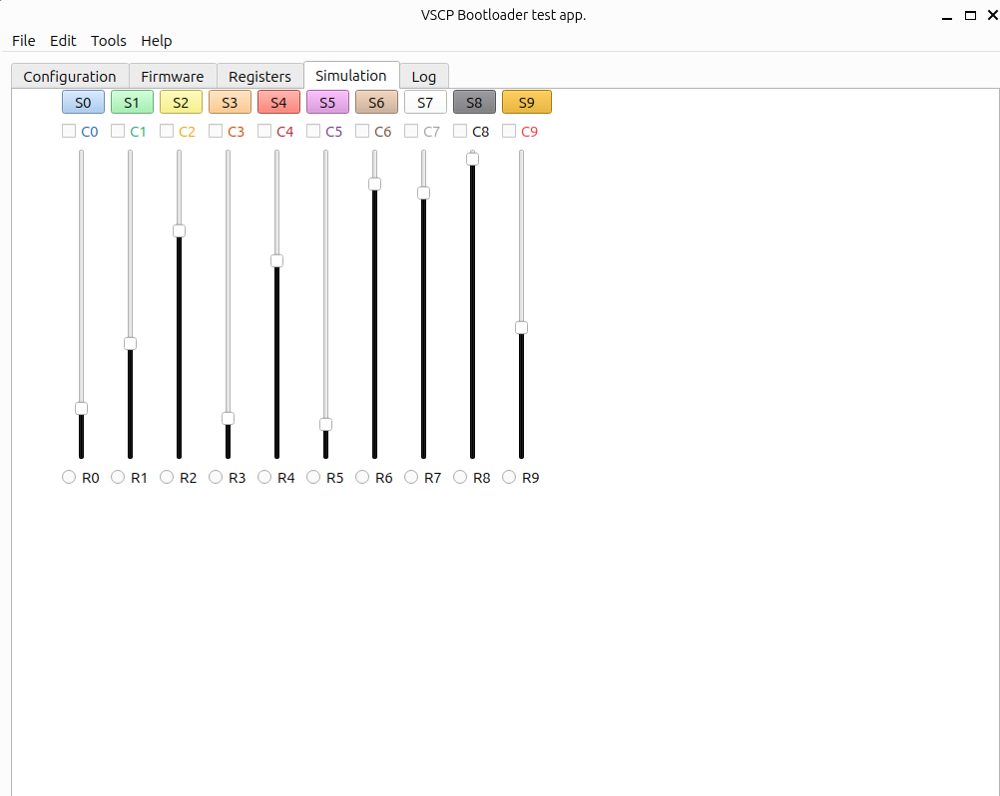

# vscp-simulator


[](https://www.repostatus.org/#active)


This is a simple test software thats simulates all functionality of a VSCP level I or a Level I node. It can be used for testing of the [VSCP bootloader](https://grodansparadis.github.io/vscp-doc-spec/#/./vscp_boot_loader_algorithm) or VSCP node functionality.

This software is created for (cross)testing and validation of new functionality and not intended for public use.

The following transport mechanisms are available

| Transport | Availability | OS |
| ----------| ------------ | -- |
| socketcan | Currently available. | Linux |
| CANAL | Soon... | Linux, Windows |
| tcp/ip server | Soon... | Linux, Windows |
| tcp/ip client | Soon... | Linux, Windows |
| MQTT | Soon... | Linux, Windows |
| Websocket version 1 | Soon... | Linux, Windows |
| Websocket version 2 | Soon... | Linux, Windows |
| Ethernet | Planned | Linux, Windows |
| UDP | Planned.| Linux, Windows |
| Multicast | Planned. | Linux, Windows |

## Get source code

Check out the souce code from the repository with

  git checkout --recurse-submodules -j8 https://github.com/grodansparadis/vscp-simulator.git

Change folder to **vscp-simulator**

```bash
mkdir build
cd build
cmake -DCMAKE_BUILD_TYPE=Debug -DCMAKE_PREFIX_PATH=~/Qt/6.7.3/gcc_64 ..
make
```

*DCMAKE_PREFIX_PATH* is the path to QT you set it to the folder and the verison of QT you want to use with the vscp-simulator. All versions > 5.15 should work. If using visual studio code set this environment variable in **cmake: configure environment** in the settings for vscode.

The executable is named **btest** 

## Command line switches

| Short | Long  | Desription |
| ----- | ----- | ---------- |
| -b | --bootmode | Set bootmode flag "-b 0"=start firmware app. "-b 0xff" != start bootloader. |
| -B | --block | Block info on the form "size:count" where size is he size of a block in bytes and count are the number of blocks of that size. |
| -c | --config | Semicolon seperated string for interface settings. |
| -f | --cfgfile | Path to JSON configuration file. A sample configuration file named *firmware_example1.json* is available in the debug folder of the project  |
| -g | --guid | GUID for simulated device. LSB byte is the only valid byte for Level I devices. |
| -h | --host | Host to connect to (valid for tcpip, mqtt, etc). |
| -i | --interface | Interface to use ("socketcan", "canal", "tcpip", "mqtt", etc). |
| -l | --level | 0/1 VSCP level. (0=Level I / 1=Level II) |
| -L | --loglevel | Debug level for console/file on the form level-console:level-file |
| -p | --password | Password to use for connection. |
| -P | --port | Port to uise for connection. |
| -S | --sub | Topic to subscribe to (MQTT). Can be semicolon separated list. |
| -t | --timeout | Timeout in milliseconds |
| -T | --pub | Topic to publish to (MQTT). Can be semicolon separated list. |
| -u | --user | Username to use for connection. |

### Firmware mode
The code normally starts up in firmware mode and then simulates all functionality of a VSCP level I or level II node. Set the functionality you want with command line switches or in a configuration file (-f switch).

### Bootloader mode
In bootloader mode the interface (-i) must be specified as any parameters for it (-c). bootmode must be set by setting -b0xff and -B must me used to specify block size and number of blocks. Some interfaces like MQTT , tcp/ip etc may need username/password and other settings.

```bash
btest -i socketcan -c vcan0 -b 0xff -B 256:1024
```

is a typical startup line to test the bootloader over a socketcan interface.

## Configuration file format

The configuration file (set path with -f switch) is in JSON format and defines the simulated firmware of the node. If this file is not available a default configuration will be used.

```json
{
  "interface": {
    "type": "socketcan",
    "config": "value1;value2;value3",
    "flags": 12345,
    "connect-timeout": 5000
  },
  "bootloader": {
    "blocks": 1000,
    "blocksize": "0x100"
  },
  "device": {
    "name": "VSCP simulated node",
    "level": 2,
    "guid": "00:00:00:00:00:00:00:00:00:00:00:00:00:00:00:00",
    "mdfurl": "eurosource.se/sim1_l1.mdf",
    "bUse16BitNickname": true,
    "nickname":"0x1234",
    "bootflag": 0,
    "hertbeat-interval": 60,
    "caps-interval": 300,
    "bEnableLogging": true,
    "log-id": 123,
    "bEnableErrorReporting": true,
    "m_bSendHighEndServerProbe": true,
    "m_bHighEndServerResponse": true,
    "m_bEnableWriteProtectedLocations": true,
    "user-id": [0,1,2,3],
    "manufactured-id": [0,1,2,3],
    "manufacturer-sub-id": [0,1,2,3],
    "firmware-version": [0,0,1],
    "bootloader-algorithm": 0,
    "standard-device-family-code": [0,1,2,3],
    "standard-device-type-code": [0,1,2,3],
    "firmware-device-code": [0,1],
    "ip-addr": [0,1,2,3]
  }
}
```
All numerical values can be set as a number or a string with hex (0x) / octal (0o) / binary (0b) / decimal,  prefix signaling how it should be converted to the numerical value. Called *"numerical string"* below.

All arrays can be set using the meachism used for numerical values (value/string converted to value) 

### interface
Client interface. Can currently be "socketcan", "canal", "mqtt", "tcpip", "udp", "multicast","ws1", "ws2" or "eth"

### config
A semicolon separated string with configuration data for the client interface. The format is specific for the interface use.

### flags
Bit flags for the interface. Form a 32-bit unsigned value. 

### name
Name of the device. Can be a maximum of 64 bytes long.

### level
VSCP level to use for device. Can be 1 or 2.

### guid
GUID for device. Can be set as string, or array. LSB byte is the only valid byte for Level I devices.

### mdfurl
URL poiting to external MDF file. If set to empty string ("") the MDF is internal. If the mdf is preceedid with "local://" a local file will be used to load the mdf. Max 32 bytyes can be used for none local file url's

### bUse16BitNickname
Tell that a 16-bit nickname should be used. 

### nickname
This is the initial nickname used when the system starts up. Unititialized devices with nickname
set to 255 (0xff) will do a nickname discovery to find a free nickname. The value can be a number or a string with hex (0x) / octal (0o) / binary (0b) / decimal,  prefix ignaling how it should be converted to the nickname number. 

### bootflag
The boot flag is used by the device to know which code to run. If it is zero the application will run. If it is nonzero (normally 0xff) the bootloader will run.

### hertbeat-interval
Heartbeat event interval in seconds. If set to zero no heartbeat events will be sent.

### caps-interval
Capabilities event interval in seconds. If set to zero no capability events will be sent.

### bEnableLogging
If set to true logging events will be sent by the device

### log-id
Logging channel to use, 0-255

### log-level
Set the log level. A sample is

 | Byte | Description     | 
 | :----: | -----------   | 
 | 0    | Emergency.      | 
 | 1    | Alert.          | 
 | 2    | Critical.       | 
 | 3    | Error.          | 
 | 4    | Warning.        | 
 | 5    | Notice.         | 
 | 6    | Informational.  | 
 | 7    | Debug.          | 
 | 8    | Verbose.        | 

 but its up to the designer to choose schema.

### bEnableErrorReporting
Enable error reporting by the device. Error events will be sent.

### bSendHighEndServerProbe
Enable sending of high end server probe. (Only for Level II devices).

### bHighEndServerResponse
Enable responseevent on high end sever probe. (Only for Level II devices).

### bEnableWriteProtectedLocations
If set to true manufacturer id, manufacturer sub id and guid can be written. On live units this is used to set initial parameters on a device. The page select register must me set to 0xffff for any writes
to be accepted.

### user-id
The user id is four bytes that are client writable on a device. TGhe written data is persistent. The initial value is set here. It can be set as an array, a decimal value or as a "numerical string".

### manufactured-id
The manufacturer id is a four byte id that is set during manufacturing of a device. The value is set here. It can be set as an array, a decimal value or as a "numerical string".

### manufactured-sub-id
The manufacturer sub id is four byte id that is set during manufacturing of a device.  The value is set here. It can be set as an array, a decimal value or as a "numerical string".

### firmware-version
This is the firmware version for the current code. The value is set here. It can be set as an array, a decimal value or as a "numerical string".

### bootloader-algorithm
Bootloader algorithm the device uses.

### standard-device-family-code
This four byte value specifies the VSCP standard family code for the device. The value is set here. It can be set as an array, a decimal value or as a "numerical string".

### standard-device-type-code
This four byte value specifies the VSCP standard type code for the device. The value is set here. It can be set as an array, a decimal value or as a "numerical string".

### firmware-device-code
This is a 16-bit code that the manufacturer set to identify the device type so that application that want to load firmware know which firmware to select. Typically the value identify the hardware reversion after which differenet firmwae is required. Also the running firmare itself can use this value to adopt itself to the hardware.

### ip-addr
Ip address is the ipv4 or ipv6 address for a device that has one. Set to all zero if other mechanism like DHCP set the ip address. It can be set as a 32-bit integer for ipv4, a string or as an array of 8-bit numbers for ipv4 and and array of 16-bit numbers for ipv6.

## Simulation

The software has the ability to provide many simulations. Currently only one called **sim1** is avilable.

### sim1



The simulation has

 * Ten buttons that send [TurnOn](https://grodansparadis.github.io/vscp-doc-spec/#/./class1.control?id=type5) events when pressed.
 * Ten checkboxes that send [Opened](https://grodansparadis.github.io/vscp-doc-spec/#/./class1.information?id=type7) and [Closed](https://grodansparadis.github.io/vscp-doc-spec/#/./class1.information?id=type8) events when selected/deselected.
 * Ten sliders that sends [Relative Level](https://grodansparadis.github.io/vscp-doc-spec/#/./class1.measurement?id=type50) events when they are move.
 * Nine radio buttons that that send [On](https://grodansparadis.github.io/vscp-doc-spec/#/./class1.measurement?id=type50)  and [Off](https://grodansparadis.github.io/vscp-doc-spec/#/./class1.information?id=type4)events when they are selected/deselected.
 * The background color as an RGN value for the simulation tab can be set with register writes.
 * A timed event is available wich have a configurable frequency. The timed event send a simulated temperature value.

The simulated node has a configurable zone and all controls has there own configurable subzone.

There are registers which can be written to set the value for all controls.

The MDF for this simulated node working as a level I  device is available in the MDF folder of the project as **sim1_l1.xml**. The "l1" in the name is the level and thus will the level II equivalent be *sim1_l2.xml*.

The MDF files are available from a public server as well

 * [sim1_l1.xml](http://eurosource.se/sim1_l1.xml)
 * [sim1_l1.json](http://eurosource.se/sim1_l1.xml)


