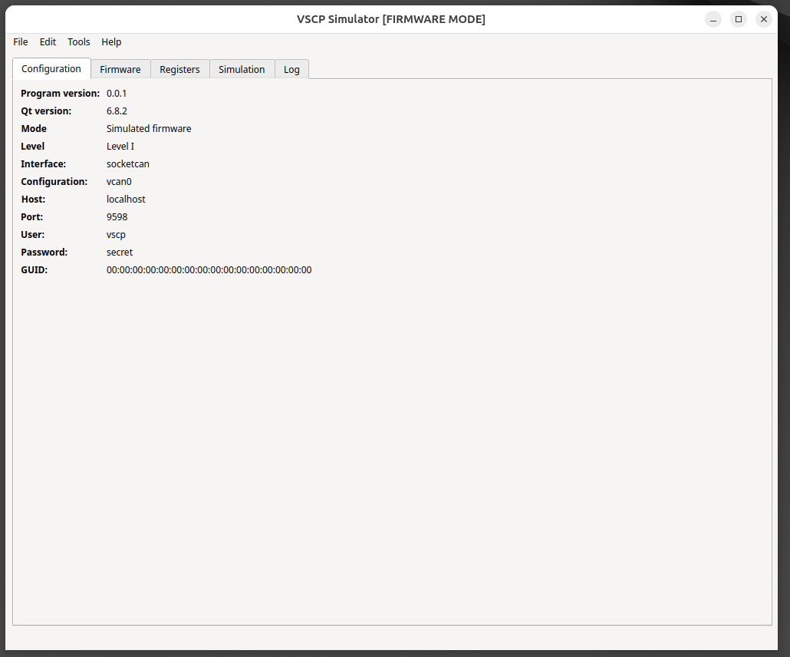
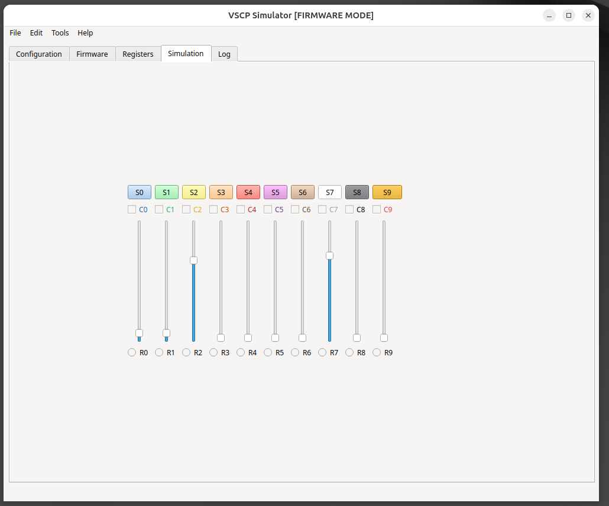

# Introduction

The VSCP simulator is a software package that can simulate a VSCP node. The application can simulate both a level I and a level II node and can work both in bootloader mode and in firmware mode. The simulator can be used to test and debug VSCP applications and is a valuable tool for developers and testers. Typical use is to validate software solutions.

The simulator is written in C++ and is available for Windows, Linux, and MacOS. It is open-source and can be downloaded from the [vscp-simulator GitHub repository](https://github.com/grodansparadis/vscp-simulator).

First tab when the simulator is in firmware mode. You can manually switch to bootloader mode or do so with the VSCP protocol.

First tab when the simulator is in bootloader mode. You can manually switch to firmware mode or do so with the VSCP protocol by uploading a valid firmware image.

The simulation have buttons, checkboxes and sliders. All issue events and registers can be set to control them. RGP colors can be set and read. The simulator can also be controlled by the VSCP protocol.

The MDF for the simulator is available [here](http://eurosource.se/vscpsim_1.xml).
